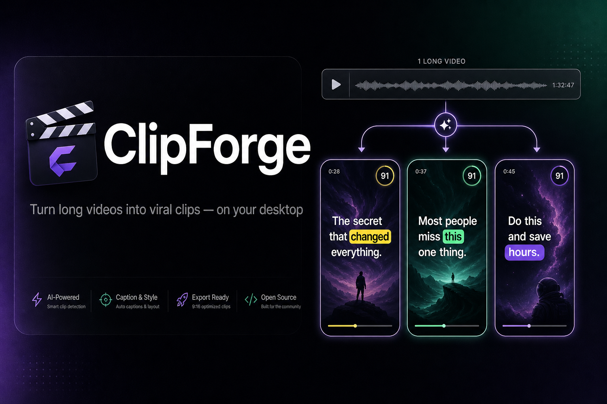
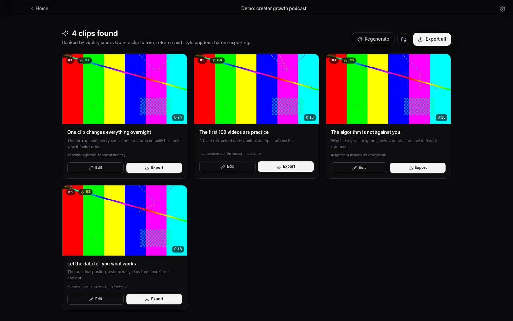
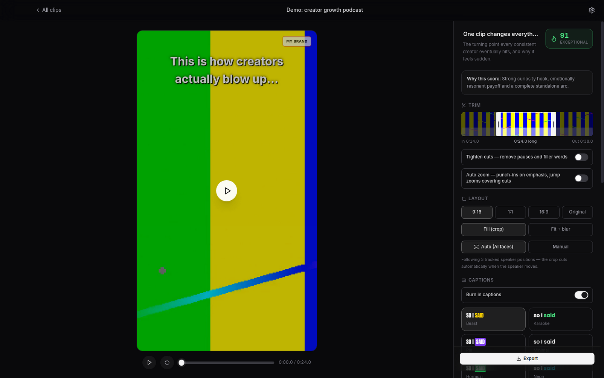

<p align="center">
  
</p>

<h3 align="center">The open-source Opus Clip alternative that runs on your desktop.</h3>

<p align="center">
  Turn podcasts, webinars, streams and interviews into ready-to-post vertical clips —<br/>
  AI-picked moments, virality scores, animated captions, auto zoom and speaker-aware reframing.
</p>

<p align="center">
  <a href="https://github.com/JeremySNR/j-clip/releases/latest"></a>
  <a href="https://github.com/JeremySNR/j-clip/actions/workflows/ci.yml"></a>
  <a href="LICENSE"></a>
  
  <a href="https://github.com/JeremySNR/j-clip/pulls"></a>
</p>

---

## Why ClipForge instead of Opus Clip?

Opus Clip is great — and it costs a subscription, runs in the cloud, and uploads your footage. ClipForge gives you the same core workflow as a free desktop app: you bring an OpenAI API key and pay **cents per video** instead of dollars per month.

|                          | **ClipForge**                                   | Opus Clip (and similar SaaS)      |
| ------------------------ | ----------------------------------------------- | --------------------------------- |
| Price                    | Free & open source (MIT) — pay only OpenAI API cents | Monthly subscription          |
| Your footage             | Stays on your machine — only audio, transcripts and a few frames go to the API | Uploaded to their cloud |
| Processing minutes       | Unlimited                                       | Capped per plan                   |
| Watermark                | Your own logo, or none                          | Removed on paid tiers             |
| Models                   | Your choice (GPT-5 series, or the budget legacy option) | Theirs                    |
| Extensible               | Fork it, script it, PR it                       | Closed                            |

Typical cost: **~$0.36/hour of video** for Whisper transcription plus a few cents of LLM analysis with the default `gpt-5.4-mini`.

## What it looks like

<p align="center">
  
  
</p>

## Features

**Finding the clips**

- **Import anything** — local files (MP4/MOV/MKV/WEBM…) or paste a URL: YouTube, Vimeo, TikTok, Twitch and every other site yt-dlp supports. Private or SSO-protected videos (e.g. enterprise Vimeo) work by borrowing the login from your browser — no server integration.
- **Whisper transcription** with word-level timestamps, chunked automatically for long videos, checkpointed so retries and re-generations never pay for transcription twice.
- **Research-grounded viral moment detection** — an LLM picks self-contained hook → build → payoff micro-stories (never clips that trail off on setup), steered by your own prompt if you want ("find the funniest exchanges"). A second AI pass reviews every clip's ending and extends it to the beat that completes the thought.
- **Two-pass virality scoring (0–99)** — a text rubric built on Berger & Milkman's *What Makes Online Content Viral?* (JMR 2012) plus measured vocal energy, ensembled with a vision pass implementing Kayal et al. (ACL 2025) that scores sampled frames for scroll-stopping potential.

**Making them good**

- **Auto zoom** — scene-aware punch-ins on the speaker's most energetic lines, jump zooms that cover cuts, and slow creep on static stretches, mirroring how top short-form editors drive retention.
- **Tighten cuts** — pauses and filler words ("um", "uh") removed automatically; captions, B-roll, zoom and the face track all remap to the compacted timeline.
- **Speaker-aware auto-reframe** — on-device face tracking (UltraFace via ONNX Runtime, no cloud) follows the active speaker; the 9:16 crop cuts between speakers like a camera switch.
- **12 caption styles + your own fonts** — karaoke-style word highlighting burned in with libass; upload any TTF/OTF and previews match exports exactly.
- **Your branding** — overlay your logo or watermark (corner, size, opacity) on the preview and every export.
- **AI B-roll** — say "Yoda" and a picture of Yoda pops over the video at that word (Wikipedia/Openverse images, no extra API keys).
- **A real editor** — filmstrip trim with waveform and live playhead, click-to-seek transcript that doubles as a trim tool, aspect ratios (9:16 / 1:1 / 16:9), live preview that matches the export.

**Shipping them**

- **Export** H.264/AAC MP4s with burned-in captions — loudness-normalised to −14 LUFS, gentle audio tail fade, three quality tiers, NVIDIA NVENC GPU encoding with automatic CPU fallback.
- **AI post captions** — one click writes a scroll-stopping TikTok/Reels/Shorts caption (hook-first line, one engagement driver, niche hashtags), copy it and jump straight to TikTok Studio upload.
- **In-app updates** — packaged builds download and install updates themselves; source checkouts update with one click (pull → rebuild → relaunch).

## Quick start

```bash
git clone https://github.com/JeremySNR/j-clip.git
cd j-clip
npm install
npm run dev        # development with hot reload
npm run package    # distributable build (dmg / nsis / AppImage)
```

Requirements: **Node.js 20+** and an [OpenAI API key](https://platform.openai.com/api-keys) (entered in-app, stored encrypted with Electron `safeStorage`). FFmpeg is bundled — nothing else to install. Prebuilt Linux AppImages are on the [releases page](https://github.com/JeremySNR/j-clip/releases/latest).

Everything except transcription and analysis runs locally: rendering, face tracking, editing, zoom and export never leave your machine. Only extracted audio, transcripts and a few sampled frames are sent to the OpenAI API — never the full video.

## Architecture

```
src/
├── main/                  Electron main process
│   ├── pipeline/
│   │   ├── ffmpeg.ts      probe, audio chunk extraction, thumbnails
│   │   ├── openai.ts      minimal REST client (Whisper + structured chat)
│   │   ├── transcribe.ts  chunked transcription, timestamp stitching
│   │   ├── highlights.ts  LLM viral-moment detection, scoring, ending review
│   │   ├── faces.ts       UltraFace face tracking + scene-cut detection
│   │   ├── energy.ts      per-segment vocal energy (arousal signal)
│   │   ├── ytdlp.ts       yt-dlp binary management + URL downloads
│   │   ├── broll.ts       LLM keyword tagging for B-roll inserts
│   │   ├── imagesearch.ts keyless Wikipedia/Openverse image search
│   │   ├── encoders.ts    NVENC detection/verification, GPU ffmpeg download
│   │   ├── captions.ts    ASS karaoke subtitle generation
│   │   ├── socialCaption.ts AI post-caption writer
│   │   └── render.ts      cut, reframe, auto zoom, watermark, burn-in
│   ├── updates.ts         GitHub release checks + self-update
│   ├── fonts.ts           custom caption fonts (sfnt parsing, merged fontsdir)
│   ├── ipc.ts             typed IPC handlers
│   ├── settings.ts        encrypted API key, models, branding
│   └── projects.ts        project persistence (userData/projects)
├── preload/               context-isolated typed bridge
├── shared/                types, caption styles/layout, tighten + zoom planners
└── renderer/              React UI (Tailwind, Zustand)
```

The live preview and the export share the same planning code (`src/shared/` — caption layout, tighten cuts, zoom), so what you see is what gets rendered.

## Tests

Unit tests, typecheck and lint run in CI on every push, alongside the offline pipeline test and a UI smoke test:

```bash
npm test               # vitest unit tests
npm run typecheck
npm run lint
```

Integration test scripts live in `scripts/` (`test-pipeline`, `test-e2e`, `test-quality`, `test-encoders`, `test-resilience`, `test-broll`, `test-youtube`, `smoke-test.sh`) — see each file's header for what it covers; the e2e ones need `OPENAI_API_KEY`.

## Roadmap

- Direct publishing/scheduling to socials (needs an audited TikTok/YouTube app — contributions welcome)
- Multi-language caption translation
- Manual zoom keyframes on the timeline

## Contributing

Issues and PRs are welcome. The codebase is TypeScript end-to-end, and `npm test && npm run typecheck && npm run lint` must pass — CI enforces all three plus an offline render test.

## License

[MIT](LICENSE)
