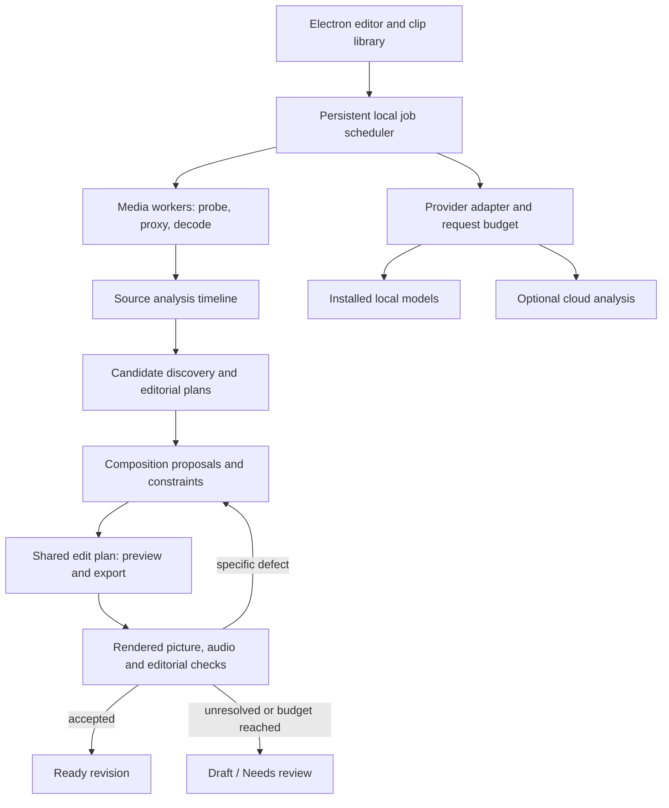

# Adaptive clipping: implementation and release plan

Date: 20 September 2026. Status: roadmap with an initial presenter/content implementation in v0.11.0; see [implementation status](adaptive-clipping-status.md) for shipped behavior and outstanding work. Deployment decision: hybrid, as selected by the user—local media processing and optional cloud AI. Numbers below are initial engineering targets or sizing assumptions, not measured product performance.

## 1. Product contract and scope

Cutawan should recommend complete, source-faithful, readable clips, automatically repair detectable defects, and distinguish an unfinished or uncertain result from one that passed its checks. It cannot guarantee popularity, recover details absent from the source, or certify that a model missed nothing.

The first supported release covers talking heads, interviews, screen demonstrations, and presenter-plus-content recordings, including changing source layouts. The architecture supports additional categories; gameplay, sports, visual-only stories, and complex panels each need their own evaluation gate before receiving the same quality claim.

Quality and execution location are separate choices. A weaker machine gets smaller batches, fewer concurrent jobs, and optional remote analysis—not an undisclosed lower acceptance threshold. If the selected local models cannot meet the gate, the result remains a draft or needs review. Existing editing and export must continue offline; new AI analysis depends on the selected provider and installed local capabilities.

## 2. What users see

### Import and setup

Keep the current import flow. Ask for destination format, desired clip length, and optional audience/topic. Default source type to Auto. Add a plain-language processing choice: On this device / Allow cloud analysis. Explain the actual data sent before enabling a new cloud route: audio, selected images, or short video excerpts. Do not silently upload the original video.

Detect device capability automatically. Offer Quiet / Balanced / Faster processing independently from export quality. Show a measured estimate once enough work has completed; use an estimate range, not a fabricated countdown. Optional downloads show model size, disk requirements, and purpose.

### Processing and clip library

Show understandable stages: Understanding video → Finding moments → Composing clips → Checking results. Let completed drafts appear progressively. Prioritize the clip the user opens over background work. Pause and resume survive app restarts.

Clip cards show the actual rendered composition, duration, a short editorial reason, and one of Draft / Checking / Ready / Needs review. Ready means the configured checks passed for that exact edit revision; it does not imply measured audience performance. Put diagnosed issues behind a concise explanation. Separate editorial ranking from verification state, and expose rejection/coverage statistics so apparent quality cannot improve merely by discarding difficult sources.

Export ready clips is the primary batch action. Manual export of a draft remains possible with its unresolved issue visible; do not block a deliberate manual edit behind an opaque AI judgment. An export button must not claim that encoding completion establishes editorial quality.

### Editor

Retain the existing trim, transcript, caption and styling tools. Add:

- A large output preview, optional source view with detected-region outlines, and a shot/layout strip below the timeline.
- Layout choices expressed as outcomes: Content first, Speaker first, Shared view, Full scene. Display only useful alternatives for the current interval.
- Direct source-region correction, destination repositioning, and a lock scoped to this shot or the selected interval. A moved source webcam and a moved output speaker layer are different edits.
- An issue marker such as “00:16: graph label becomes unreadable”; selecting it seeks there. Repair this section only creates a reversible plan revision.
- A compare control for the previous and proposed edit, an undo path, and optional safe-area guides for the selected destination.

The screenshot example uses two synchronized crops from the original video: the presenter inset and the graph. The presenter may originate in any corner. A detail view follows the discussion, while labels and relationships stay intact. Captions use unoccupied space. Title overlays are optional and subordinate to useful source content. Never redraw factual charts or synthesize missing source pixels as part of automatic reframing.

## 3. Architecture and data contracts

Use five versioned contracts, validated at every process/provider boundary:

1. **SourceAnalysis:** source fingerprint, presentation-time mapping, shot boundaries, entity tracks with full rectangles, text spans, audio turns, speaker association, visual events, evidence references, confidence and analysis coverage. Model outputs are observations, not truth. Unknown and offscreen speakers are valid states.
2. **CandidateEdit:** source intervals, preserved speech/actions/reactions, hook and payoff evidence, context dependencies, audience relevance, duplicates, and rejection reasons. Allow speech-led and visual-led candidates to coexist.
3. **EditPlan:** rational/integer timebase, source-to-output segment map, output dimensions, independently timed layers, source rectangles, destination rectangles, fit policy, z-order, bounded crop paths, captions, safe areas, user locks, and source/model/prompt versions. Include audio routing so duplicating a video layer never duplicates audio.
4. **ValidationReport:** plan/render hash, required checks, measured results, coverage, uncertainty, findings with timestamps, repair attempts, and reviewer versions. A changed plan invalidates affected checks; a previous pass cannot be copied onto a new export without verification.
5. **JobRecord:** inputs, dependencies, resource reservation, state, attempts, checkpoints, artifact hashes, elapsed time, cloud usage and cancellation. Keep execution state separate from output acceptance.

Suggested modules: `src/shared/editPlan.ts`, `analysisTimeline.ts`, `validation.ts`; `src/main/jobs/`, `media/`, `analysis/`, `composition/`, `validation/`, `providers/`; renderer components for layout choices, timeline intervals, and findings. These are proposed paths, not existing modules.

Keep small editable project metadata in the existing atomically replaced project JSON. Add a local SQLite index/journal for jobs, cache entries and source-analysis references; store large immutable arrays/media in sidecar artifacts. Isolate the database adapter in a worker and validate packaged native compatibility before adopting a binding. Recover by reconciling artifact hashes and journal entries; do not assume file writes and database transactions are one atomic operation.

### Source analysis and discovery

Analyze each source once, reuse overlapping clip intervals, and refine uncertain regions on demand. Normalize orientation, sample aspect ratio, presentation timestamps and color metadata. Variable-frame-rate timestamps must map back to the original accurately; frame index divided by nominal FPS is insufficient.

Use a coarse whole-source pass for shots, visual changes, audio activity and candidate recall. It must see silent regions as well as speech. Decode at higher resolution for small faces/text and denser temporal sampling around actions, cuts, moving panels and uncertainty. Track entities continuously between expensive observations. Preserve relation groups such as hands + demonstrated object, chart + labels, or player + ball + goal.

Compare transcription and forced alignment independently. Preserve original recognized text, acoustic evidence and corrections; do not let a language model silently invent words. Match diarized audio turns to visible people using audiovisual evidence, with explicit unknown/overlap states.

Unite transcript, visual-event and audio-event candidates. Assess surrounding context before selecting boundaries. Deduplicate semantically and temporally. Keep the required demonstration/result through tightening. Cache all expensive source analysis by stage, interval and version, rather than redoing it for each proposed clip.

### Composition

Build a small set of composable primitives: tracked single region, intact content region, presenter inset, shared/multi-person view, overview/detail, full-scene fit and text layers. Source placement does not determine destination placement. A clip may change primitive at a shot or meaningful event boundary.

Initially generate at most three viable composition candidates for an uncertain interval. Hard constraints reject lost mandatory content, collisions, invalid geometry, unacceptable enlargement, and unsafe time mapping before any aesthetic ranking. Optimize remaining choices for readability, stable framing, appropriate headroom, continuity, useful screen occupancy and editorial emphasis. Penalize unnecessary switching, use dwell time/hysteresis, and inspect future positions within the shot.

A visual model can propose regions and priorities. Deterministic code validates coordinates, layer bounds, timing, and motion limits. Provider model choice remains behind adapters and is decided by measured finished output, including a stronger reference method before cheaper variants are accepted.

### Rendering and checking

Compile the same EditPlan into preview and FFmpeg operations. Share all geometry/time functions; prove parity with a frame comparison suite, including fonts, rotation, pixel rounding, safe areas and color handling. Use one source playback clock and one decoded frame for simultaneous crops. Prefer a lightweight canvas compositor first; add GPU preview rendering only if profiling justifies it.

Render proofs only for shortlisted candidates. Low-cost proofs check geometry and motion; readability checks must also inspect the final intended scale/encoding so a low-resolution proof cannot falsely pass or reject text. Composite multiple crops from one decoded stream where feasible. Limit simultaneous render branches and divide unusually complex plans at safe timeline boundaries, preserving exact audio/time mapping.

Checks combine deterministic media/geometry tests, tracking, OCR evidence, acoustic alignment and independent editorial review. Source/reference comparisons are essential: output-only black-frame detection must not flag intentional black scenes as failures. OCR confidence is supporting evidence, not proof of comprehension. Use dense checks around transitions and high-risk intervals; record the limits of sampled semantic review.

Classify failures by responsible stage. Allow two repair attempts initially, then retain the best valid version and mark the unresolved finding. Re-run affected checks and final boundary/continuity checks after a repair. A different prompt to the same model is not an independent ground truth. Real audiovisual human evaluation remains the release reference.

## 4. Running well on ordinary machines

### Global resource scheduler

Replace independent per-stage concurrency limits with one admission controller spanning decoding, inference, transcription, proof rendering, final encoding and cloud calls. Existing `mapLimit` helpers can remain inside a reservation, but must not multiply expensive work invisibly.

Each task declares estimated RAM, CPU threads, GPU memory and decoder/encoder needs. Admit work only when reservations plus UI/OS headroom fit. Measure the complete process tree and GPU/shared-memory pressure, not only the inference child. Start conservatively; tune with measured peaks. Apple unified memory is a shared pool, not extra GPU RAM.

Give interactive preview and the active clip priority. Reserve capacity for the UI and pause background analysis under pressure. Cap FFmpeg and inference threads together. Bound IPC queues and prefer compact paths/artifact references over serialized frame tensors. Use ring buffers, backpressure and disk-spooled intermediates for long sources. A 3-hour recording must not retain 3 hours of raw crops in RAM.

The current inference frontend already batches work, but `runCropPass` retains track crops for the selected interval. Convert long-interval processing to streaming windows with sufficient overlap, deterministic boundary stitching and identity continuity. Test window seams explicitly. Keep compact embeddings/tracks on disk when necessary.

### Initial device profiles to validate

- **8 GB RAM, no discrete GPU:** target ordinary 1080p workflows; one heavy local task at a time, 540p/720p preview proxy, cloud heavy analysis when enabled. Initial total Cutawan process-tree working budget: approximately 2.5 GB, reduced further under host pressure. Large local models are optional and may not fit this profile.
- **16 GB RAM, modern CPU or Apple Silicon:** 720p/1080p proxies, initial working budget around 4 GB, two heavy jobs only when measured reservations fit. Use verified native acceleration where beneficial.
- **32 GB+ / discrete GPU:** admit additional independent work according to CPU/GPU measurements. Do not multiply jobs by core count. Preserve the same validation thresholds.

These are scheduling starting points, not minimum-system claims. Validate Windows x64, Apple Silicon macOS and Linux x64 first. Retain/test existing Intel Mac support as a compatibility tier; Windows/Linux ARM require separate packaged validation before claiming support. Publish exact OS requirements only after confirming the chosen Electron/runtime support matrix.

### Acceleration and packaging

Current export acceleration is NVIDIA NVENC-focused. Introduce independent capability adapters for decode, inference, preview, filtering and encode. An available hardware encoder does not make the whole filter graph GPU accelerated.

Prioritize Apple VideoToolbox and existing NVENC, then evaluate Intel QSV and AMD AMF/appropriate Linux paths. For ONNX, keep CPU universally available; evaluate DirectML, CoreML or CUDA only where the shipped runtime actually supports the exact model/operators. Test real inference and representative subtitle/composition encodes, not just a device-name query. Provider fallbacks and CPU/GPU transfer overhead may make nominal acceleration slower.

Pin approved model/binary versions, verify hashes, preserve license notices, use resumable optional downloads, and avoid runtime downloads from unpinned “latest” URLs. Validate acceleration in installed/signed builds, including driver failure and software fallback. Fall back automatically once, retain diagnostics, and do not repeatedly retry a broken backend. Compare visual quality at matched output constraints before selecting hardware encode defaults.

Electron recommends isolating long-running work from its main/UI processes ([performance guidance](https://www.electronjs.org/docs/latest/tutorial/performance)). ONNX's [Node support matrix](https://onnxruntime.ai/docs/get-started/with-javascript/node.html) and [provider documentation](https://onnxruntime.ai/docs/execution-providers/) must be checked against the pinned binary; a runtime feature advertised generally is not proof that our package exposes it. Encoding options are documented in [FFmpeg's codec reference](https://www.ffmpeg.org/ffmpeg-codecs.html).

### Cache and recovery

Key artifacts by source content hash, interval, transform settings, model/weights version, prompt/schema version and relevant upstream hashes. Use a cheap fingerprint provisionally while a full source hash runs; promote verified cache entries only after identity is established. Source relinking, trims and manual edits invalidate only affected descendants.

Store large artifacts outside project JSON with LRU eviction and a user-visible disk cap. Pin originals, user edits and active-job dependencies. Preflight free disk for proxies, downloads and exports. Write exports to a temporary sibling, verify them, then rename into place. A failed job must never replace the last valid export.

Crash recovery restarts only the failed task from a durable checkpoint. Limit worker restarts and isolate poison inputs; the existing inference client currently latches native failure until app restart. Handle sleep/wake, app quit, disk-full, missing source, offline operation, rate limits and cancellation of child process trees. Atomic project replacement already exists and should be retained.

## 5. Hybrid and service scaling

### Stage one: desktop plus existing provider adapters

No new hosted backend is required for the first composition release. Keep originals/rendering on-device. Send only the analysis material the configured provider requires: transcript, selected frames, audio, or bounded excerpts. Static frames cannot establish motion-dependent events; escalate to temporal excerpts when needed within the user's cloud preference.

Implement a common provider contract for capability discovery, schema validation, cancellation, request IDs, usage, retryability and limits. Route editorial proposals, visual grounding, transcription and review independently. A route must pass the same benchmark before becoming a substitute. Cache requests, coalesce identical work and apply global rate/concurrency limits.

### Stage two: optional managed analysis service

Add this when deployment/support needs or measured demand justify it. Use authenticated direct uploads to object storage, a durable task queue, metadata storage, and stateless CPU/GPU worker pools. Keep payloads out of the queue; pass object references and content hashes. Default final rendering stays on the desktop.

Use leases and idempotent result commits for at-least-once delivery. Treat provider billing separately: persist external request IDs and reconcile an ambiguous timeout before repeating a paid request where supported. Exactly-once paid execution cannot be assumed.

Apply per-account budgets, weighted fair scheduling, independent provider/GPU concurrency limits, exponential backoff with jitter, retry caps, and a dead-letter path. Autoscale on queued work seconds, oldest-job age and memory capacity, not queue length alone. Bound retries to prevent outages from creating a cost spike. Separate interactive analysis from bulk jobs.

Authenticate every artifact access, isolate tenant caches, encrypt transport/storage, use expiring object access, define deletion/retention behavior, and keep media/transcripts out of default logs. Return portable versioned analysis and edit plans so users can still edit/export locally during service outages. Service accounts/provider contracts must support this deployment; a desktop sign-in integration is not a shared multi-tenant backend credential.

### Sizing and cost discipline

Measure stage time, upload bytes, peak memory, provider requests and actual billed usage per source hour and per Ready clip. Include rejected candidates and failed attempts in cost totals.

Capacity example only: 100 source-hours arriving each hour, with 0.2 worker-hours per source-hour, requires 20 busy worker equivalents. At a 65% target utilization, budget about 31 equivalents before burst allowance. Measure service time separately for CPU, GPU and provider routes; provider quotas may be the bottleneck. This is a formula example, not a Cutawan throughput result.

Cost per Ready clip = total analysis, transfer, storage, proof and repair cost / number of Ready clips. Also report Ready clips per source-hour to avoid hiding low coverage. A project budget bounds proposals, expensive review and repairs. If it is exhausted, stop optional work and preserve drafts; do not silently loosen quality thresholds or exceed a user cap.

## 6. Delivery milestones and acceptance gates

Estimates assume one experienced full-time engineer plus part-time video-editor/QA input. They are planning ranges, exclude procurement/legal lead time and model training, and must be revised after the first performance measurements. Each milestone can ship behind a feature flag; the managed service is a separate decision.

### M0 — Baseline and instrumentation: 1–2 weeks

Freeze baseline code/model/prompt provenance and reference exports. Profile a 60-second clip, a 60-minute source and a 3-hour source on representative 8/16/32 GB machines. Measure cold and warm runs, actual cloud usage, first draft, first Ready clip, full completion, UI latency and peak process-tree RSS.

Label a development set and a creator-separated held-out set. Start with 40–60 diverse real sources and selected dense annotations; expand based on failures rather than claiming exhaustive coverage. Include the existing corpus without relabelling development examples as unseen tests.

Exit: reproducible baseline report, hardware bottlenecks, fixed evaluation protocol, and cost/runtime budgets for the next milestone.

### M1 — Edit-plan and execution foundation: 2–3 weeks

Add versioned contracts, runtime validation, compatibility adapter from legacy crops, shared time/geometry operations, durable job records, resource reservations, revision checks and cancellation. Retain the old renderer behind a flag. Migrate projects non-destructively with backup/version checks; old app versions must not overwrite new schemas.

Exit: representative legacy projects render equivalently, edits are never overwritten by stale analysis, crash/restart resumes jobs, and preview remains responsive during background work.

### M2 — Presenter/content vertical slice: 2–3 weeks

Detect independent presenter/content regions, persist full 2D tracks, propose content-first/stacked/full-scene alternatives, render synchronized layers, and expose correction/locking in the editor. Include fixed and moving insets, all four corners, changing source layouts and no-face screen demos. This is the first milestone that can produce the example composition from real video.

Exit: geometry/temporal variation suite passes, no duplicated audio, phone-size labels remain readable on supported fixtures, and human reviewers prefer the result to the baseline without increasing severe failures.

### M3 — Output validation and repair: 2–3 weeks

Implement revision-bound reports, production-compositor proofs, objective checks, independent editorial review, bounded targeted repair and Ready/Needs review UI. Carry findings into the timeline. Keep a deliberate manual-export path.

Exit: injected defects are detected at an agreed recall/false-alarm rate, known critical regressions are absent, and no stale report can certify an edited output. Validate full audiovisual clips, not only contact sheets.

### M4 — Broader discovery and composition: 3–5 weeks

Add visual-event candidates, improved audio/visible-speaker association, shared/panel layouts, object/action relation groups and duplicate suppression. Introduce visual-only support with separate product messaging. Establish additional category gates for gameplay and sports rather than enabling them globally from a few examples.

Exit: increased worthwhile-moment recall and publishable top-five precision on held-out sources, with category-level results and repair time.

### M5 — Hardware and release hardening: 2–3 weeks

Finish streaming windows, acceleration adapters, resource-pressure adaptation, cache limits, installer/native-package testing and long-session recovery. Performance work begins at M0 and runs throughout; this milestone closes release gaps rather than postponing memory work until the end.

Exit: packaged hardware matrix, soak/fault tests, cost caps, support diagnostics and rollback path pass.

Milestones M0–M3 suggest 7–11 engineer-weeks for a quality-gated presenter/content beta. M0–M5 suggest 12–19 engineer-weeks for the broader desktop release. Optional managed cloud orchestration adds roughly 3–5 engineer-weeks plus operational/security review. These are effort ranges, not a delivery-date commitment.

## 7. How we decide it is ready

### Functional and quality evaluation

- Property/invariant tests for geometry, time mapping, non-overlapping segment partitions, locks, audio routing, stale results and revision hashes.
- Controlled source variants for every inset corner, size, source ratio, slide change, occlusion and abrupt position change. Expect equivalent semantic decisions after coordinate transformations.
- Real-source categories include moving/tiny faces, overlapping/offscreen speakers, screen text, demonstrations, existing captions, multilingual speech, rapid cuts and silent action. Test known unsupported situations explicitly.
- Preview/export comparison at shot boundaries and throughout motion; CPU and hardware encoding checks use tolerances rather than demanding identical compressed pixels.
- Blind full-video review by at least two raters for hook, context, payoff, framing, captions, audio and repair time. Split by creator/recording setup, aggregate by source, and report uncertainty. Record candidate omissions as well as bad selected clips.

Initial beta targets: at least 90% of Ready clips publishable without a major correction in each supported category, progressing toward 95%; no known critical failures in the release regression set. Report false-ready rate, false-review rate and acceptance coverage. Small samples do not establish a near-zero field failure rate. Audience retention testing follows separately under comparable distribution conditions.

### Performance and resilience targets

- UI interaction latency p95 below 100 ms during analysis on the baseline machines; warmed proxy seek p95 below 300 ms on the defined test media.
- Sustained 30 fps proxy playback for supported 1080p-source workflows while background analysis is throttled; define separate 4K and high-frame-rate profiles.
- Cancellation acknowledged within 250 ms, with local child processes stopped within 2 seconds or a visible stopping state. Remote cancellation is provider-dependent and may not undo billed work.
- No app crash/OOM, orphan processes or lost edits in the supported soak/fault suite. Flat bounded raw-frame memory as source duration increases; persistent analysis may grow on disk.
- Enforce the configured request/cost cap with reservations for in-flight work. Report p50/p95 stage latency, cold/warm time and network conditions; set first-Ready and throughput commitments after M0 measurements rather than inventing processing-speed claims.

Extend existing Linux tests/smoke and packaged Apple Silicon checks with packaged Windows coverage and a scheduled real-hardware matrix. CI virtual machines cannot validate every GPU/driver. Fault-inject low disk, memory pressure, worker death, interrupted downloads, rate limits, malformed model output, sleep/wake, source relink and cache corruption. Tests must confirm semantic recovery, not merely a successful exit code.

Roll out to internal fixtures, opt-in beta, then per-category stable flags. Keep versioned model packs and renderer rollback. With opt-in diagnostics, collect stage times, resource peaks, failure codes and correction counts—not raw footage by default. Every confirmed production defect becomes a labelled regression case.

## 8. First implementation PRs

1. Add performance spans and baseline fixture runner; capture stage/process metrics without changing editing behavior.
2. Add EditPlan/ValidationReport contracts and legacy adapter with source-time and geometry tests.
3. Add persistent jobs, revision-aware commits and resource reservations around existing workers.
4. Add the multilayer compositor and matching preview, initially with manually supplied regions.
5. Add presenter/content detection and three bounded layout proposals; exercise corner/movement variants.
6. Add rendered verification, targeted repair and stateful clip-library/editor controls.

Each PR must have runnable fixtures and visible output before adding the next model-driven decision. The foundation is complete when a manually specified plan renders reliably; the AI planner earns adoption by beating that baseline on real footage.

## 9. Current evidence and dependencies

This plan was informed by the current pipeline, renderer, inference worker/client, source-type logic, project persistence, editor, encoder selection and CI. Existing worker isolation, frontend windows, streamed decoding, lazy reframing, source-time mapping and atomic saves should be preserved and extended.

Relevant project evidence: [quality benchmark](quality-benchmark.md), [September 19 release checks](../benchmarks/public-corpus/release-checks-2026-09-19.md), [screen-detail study](../benchmarks/public-corpus/screen-detail-study-2026-09-13.md). Prior results are pilot evidence with the limitations described in those documents.

Outstanding empirical decisions: actual device budgets/throughput; winning recognition, alignment, tracking and grounding methods; acceptable text-size/softness thresholds; category-specific confidence calibration; native runtime packaging; and managed-service economics. M0 measurements and held-out comparisons resolve these. None should be selected solely because a model is already bundled or advertises a higher benchmark score.
